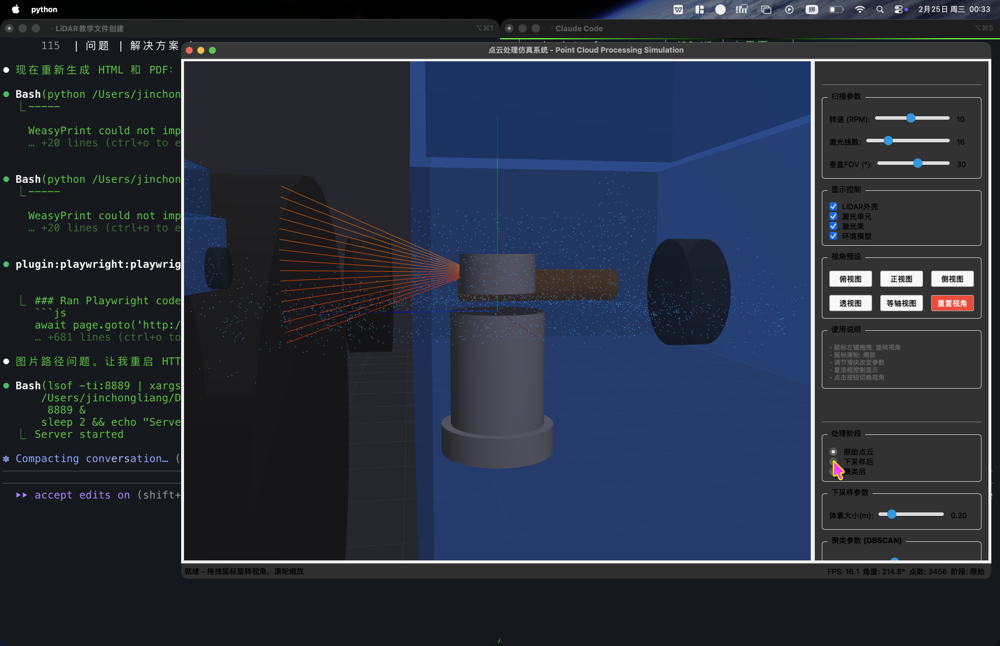
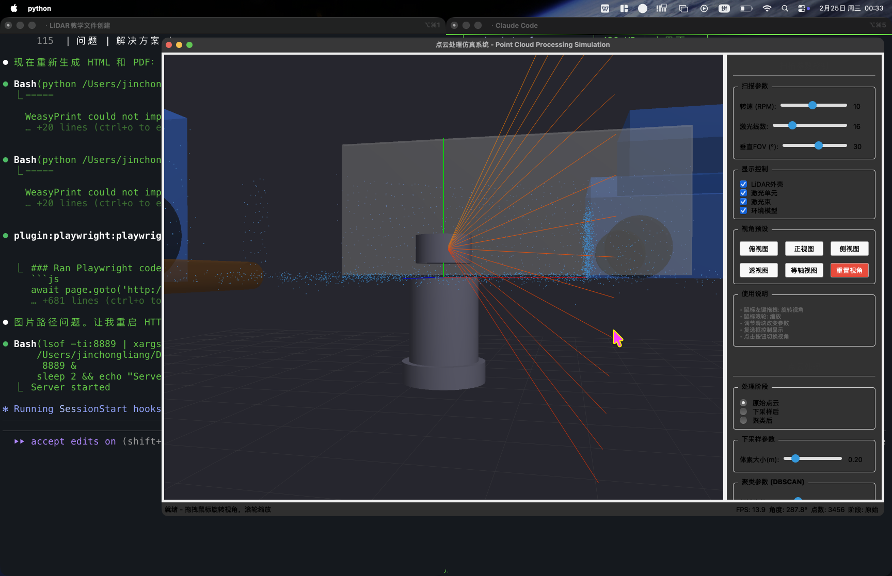
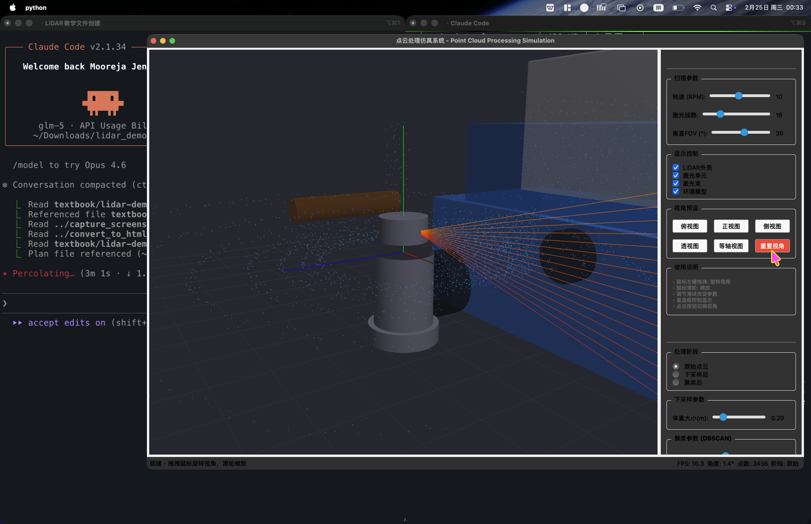
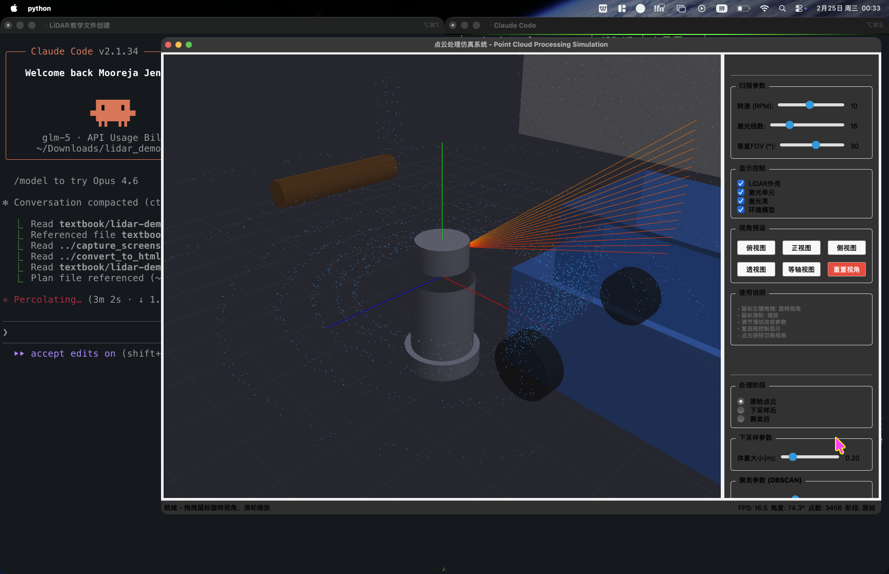
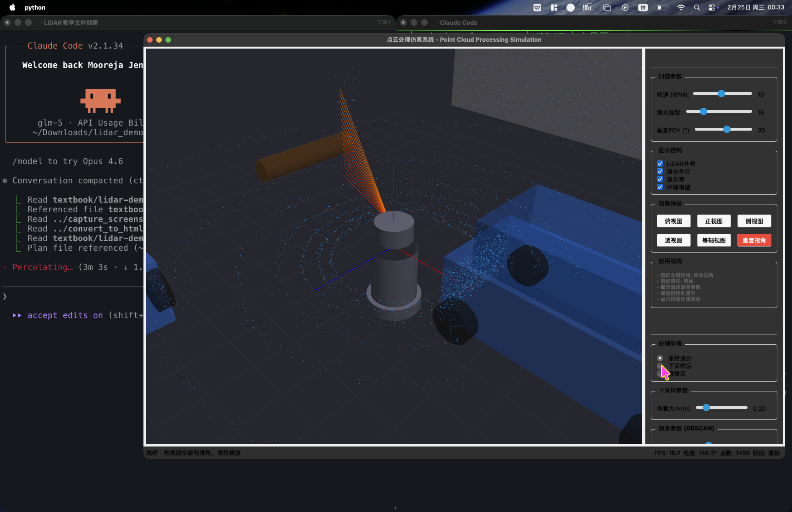
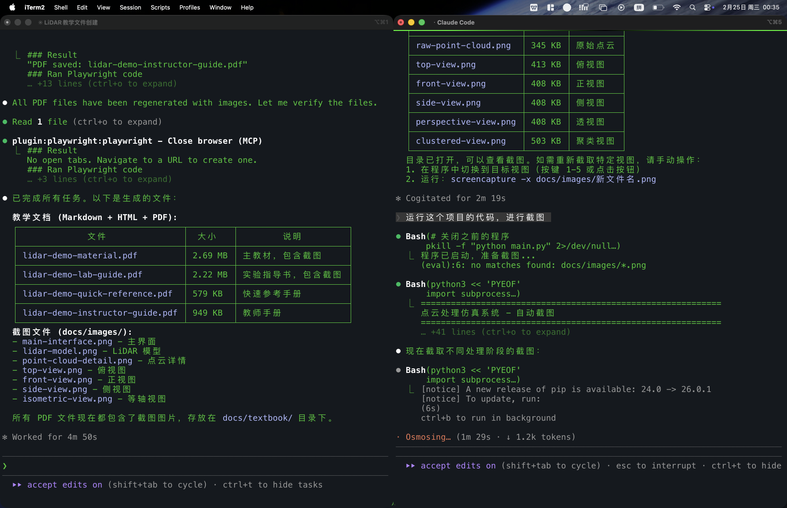
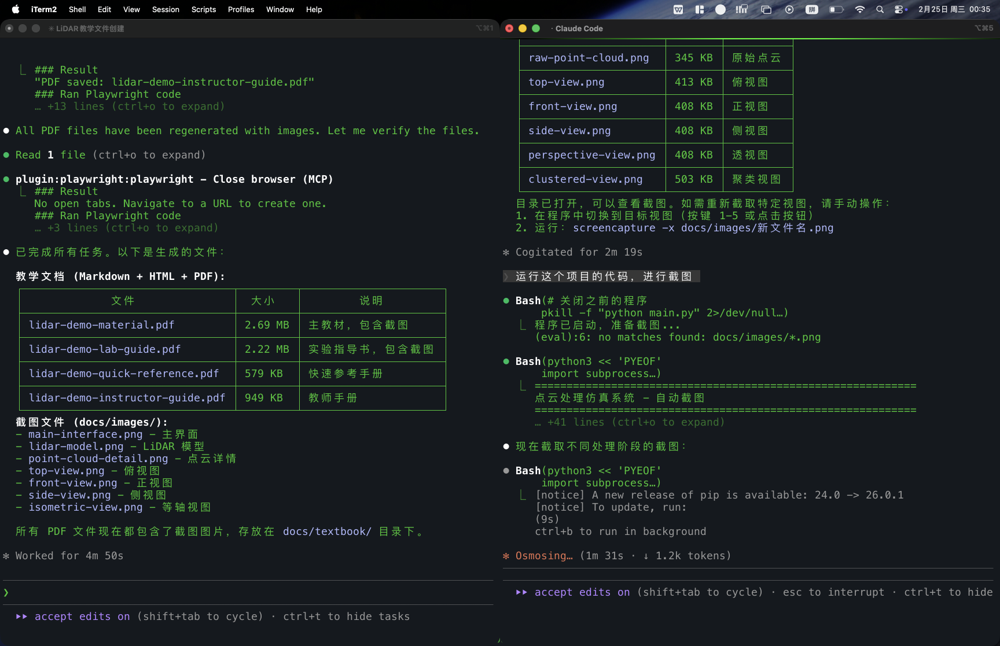

# 点云处理仿真系统

一个用于教学演示的 Python 桌面应用程序，展示激光雷达点云的生成、下采样和聚类处理过程。

## 系统截图

### 不同视角

| 俯视图 | 正视图 | 侧视图 |
|:---:|:---:|:---:|
|  |  |  |

| 透视图 | 等轴视图 |
|:---:|:---:|
|  |  |

### 处理阶段

| 原始点云 | 下采样后 | 聚类结果 |
|:---:|:---:|:---:|
|  |  |  |

### 聚类与边界框



## 功能特性

- **LiDAR 点云生成** - 使用射线投射模拟机械旋转式激光雷达
- **体素网格下采样** - 减少点云密度，保留空间特征
- **DBSCAN 密度聚类** - 自动识别独立的物体簇
- **边界框计算** - 为每个聚类生成轴对齐包围盒
- **多阶段可视化** - 原始点云 → 下采样 → 聚类的完整流程
- **真实感噪声模拟** - 距离噪声、入射角影响、随机 dropout

## 环境物体

| 物体 | 位置 | 尺寸 |
|------|------|------|
| 车辆 1 | (4, 0, 0) | 4m × 1.8m × 1.2m |
| 车辆 2 | (-3, 0, 5) | 4m × 1.8m × 1.2m |
| 墙壁 1 | (7, 2, 0) | 0.2m × 4m × 10m |
| 墙壁 2 | (0, 2, -8) | 10m × 4m × 0.2m |
| 树 (圆柱) | (-5, 0, -3) | r=0.3m, h=3m |
| 电线杆 | (6, 0, 5) | r=0.15m, h=4m |
| 障碍物 | (-2, 0, 7) | 1m × 1m × 1m |

## 快速开始

### 安装依赖

```bash
pip install PyQt5 PyOpenGL numpy scipy
```

### 运行程序

```bash
python main.py
```

## 操作指南

### 快捷键

| 快捷键 | 功能 |
|--------|------|
| `R` | 重置视角 |
| `1` | 俯视图 |
| `2` | 正视图 |
| `3` | 侧视图 |
| `4` | 透视图 |
| `5` | 等轴视图 |
| `ESC` | 退出程序 |
| 鼠标拖拽 | 旋转视角 |
| 鼠标滚轮 | 缩放 |

### 参数调整

**扫描参数：**
- RPM (1-20)：激光雷达旋转速度
- 激光线数 (1-64)：垂直方向激光束数量

**下采样参数：**
- 体素大小 (0.05-1.0m)：越大点数越少

**聚类参数：**
- eps (0.1-2.0m)：邻域半径
- min_samples (1-20)：核心点最小邻居数

## 核心算法

### 体素网格下采样

```
1. 将空间划分为大小为 v 的立方体（体素）
2. 计算每个点所属的体素索引
3. 同一体素内的点取质心作为代表点
```

### DBSCAN 聚类

```
核心概念：
- ε-邻域：以点 p 为中心，半径 ε 的球内所有点
- 核心点：ε-邻域内至少有 min_samples 个点
- 边界点：不是核心点，但在某核心点的邻域内
- 噪声点：既不是核心点也不是边界点
```

### 处理流程

```
环境物体 → 射线投射 → 原始点云
                         ↓
                    体素下采样
                         ↓
                    DBSCAN聚类
                         ↓
                   边界框 + 可视化
```

## 项目结构

```
lidar_cloudpoints/
├── main.py                 # 程序入口
├── requirements.txt        # 依赖列表
├── ui/                     # 用户界面
│   ├── main_window.py      # 主窗口
│   ├── control_panel.py    # 扫描参数控制
│   └── pipeline_panel.py   # 处理流程控制
├── opengl/                 # 3D 渲染
│   ├── gl_widget.py        # OpenGL 控件
│   ├── camera.py           # 相机控制
│   ├── scene.py            # 场景管理
│   └── environment.py      # 环境物体
├── processing/             # 点云处理
│   ├── downsampling.py     # 下采样算法
│   ├── clustering.py       # 聚类算法
│   └── pipeline.py         # 处理流水线
├── data/                   # 数据结构
│   └── point_cloud.py      # 点云类
└── docs/                   # 文档
    ├── textbook/           # 教材
    └── images/             # 截图
```

## 实验参考

### 下采样效果对比

| 体素大小 | 原始点数 | 下采样后 | 保留比例 |
|---------|---------|---------|---------|
| 0.1m | ~5760 | ~1200 | 21% |
| 0.2m | ~5760 | ~400 | 7% |
| 0.5m | ~5760 | ~100 | 2% |

### 聚类参数调优

| eps | min_samples | 簇数 | 噪声点 |
|-----|-------------|-----|--------|
| 0.3 | 5 | 15+ | 多 |
| 0.5 | 5 | 7-8 | 少 |
| 1.0 | 5 | 3-4 | 很少 |

## 技术栈

| 组件 | 技术 |
|------|------|
| GUI | PyQt5 |
| 3D 渲染 | PyOpenGL |
| 数学计算 | NumPy |
| 空间索引 | scipy.spatial.cKDTree |

## 参考资料

- [Open3D](http://www.open3d.org/) - 点云处理库
- [PCL](https://pointclouds.org/) - Point Cloud Library
- [DBSCAN](https://scikit-learn.org/stable/modules/clustering.html#dbscan) - scikit-learn 文档

## License

MIT License
